# react jobly notes (frontend)

this file codesandbox is devoted to understanding and deconstructing the demo website located here: [https://joelburton-jobly.surge.sh/](#https://joelburton-jobly.surge.sh/).  

## how to use this repository

### start server in development mode

while located in the `frontend` folder run the command `npm start` from your VSC command line.

## dependency list

this dependency list was obtained from reviewing the `node_modules` folder using Chrome developer tools which is a subfolder within the `static` folder, which is within the `joelburton-jobly.surge.sh` which is within the `top` parent folder.  The hierarchy looks like this:
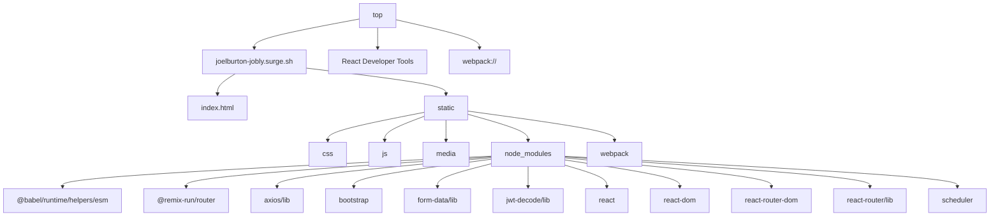

### 1. Analyze the `node_modules` Folder

The `node_modules` folder in the static directory reveals the project's dependencies because it contains libraries and frameworks bundled into the app.

From your description, the following dependencies are included:

#### 1. Core React Libraries:
- `react` → React for building UI components.
-` react-dom` → React integration with the DOM.

#### 2. Routing:
- `react-router` → Core routing logic for React.
- `react-router-dom` → React Router bindings for web applications.

#### 3. HTTP Requests:
- `axios/lib` → Axios library for making HTTP requests.

#### 4. CSS Framework:
- `bootstrap` → CSS library for responsive design and styling.

#### 5. JWT Handling:
- `jwt-decode/lib` → Library to decode JSON Web Tokens.

#### 6. Utility Libraries:
- `form-data/lib` → Utility for handling form data.
- `scheduler` → Used internally by React for scheduling updates.

#### 7. Routing Framework for Backend Logic:
- `@remix-run/router` → Likely for advanced routing logic in modern React apps.

#### 8. Babel Runtime:
- `@babel/runtime/helpers/esm` → Enables Babel-transpiled JavaScript to run efficiently.

### 2. Confirming Dependencies

To confirm the dependencies:

1. Look into the bundle files (e.g., `main.js` or `vendor.js`) in the `Sources` tab.
2. Search for the names of these libraries:
- Use `Ctrl + F` or `Cmd + F` and search for strings like:
    - react
    - axios
    - bootstrap
    - jwt-decode
3. Check how these dependencies are loaded and referenced in the bundle file:
```javascript
__webpack_require__(/*! axios */ "axios")
```
If a dependency like axios appears multiple times or in key locations, it’s part of the project.

### 3. Review `index.html` for Script References
1. Open the `index.html` file within the `joelburton-jobly.surge.sh` folder.
2. Look for script tags that load bundled JavaScript or CSS files:
```html
<link href="/static/css/main.css" rel="stylesheet" />
<script src="/static/js/main.js"></script>
```
These indicate the output files from Webpack bundling.

### 4. Dependencies Summary
From your findings, the project likely uses:
```
classDiagram
    class Core {
        react
        react-dom
    }
    class Routing {
        react-router-dom
        @remix-run/router
    }
    class HTTP_Requests {
        axios
    }
    class JWT_Management {
        jwt-decode
    }
    class CSS_Framework {
        bootstrap
    }
    class Utilities {
        form-data
        scheduler
    }
    class Transpilation_Helper {
        @babel/runtime
    }
```

## folder structure & file architecture

**Diagram 1: Overview of `js` Folder**
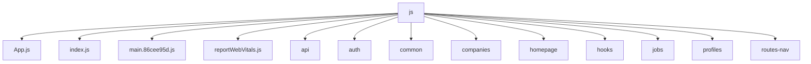

**Diagram 2: `api` Folder**
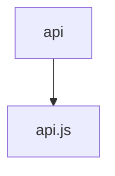

**Diagram 3: `auth` Folder**
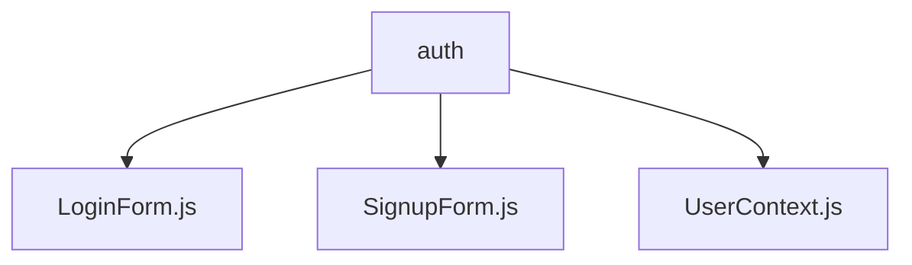

**Diagram 4: `common` Folder**
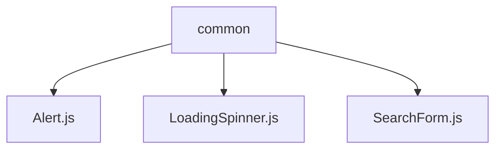

**Diagram 5: `companies` Folder**
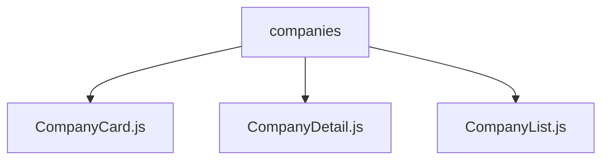

**Diagram 6: `homepage` Folder**
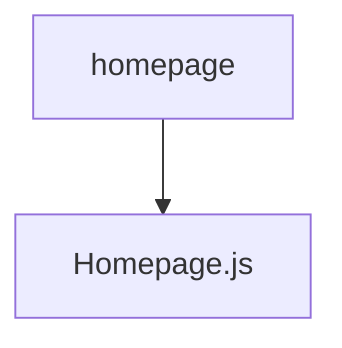

**Diagram 7: `hooks` Folder**
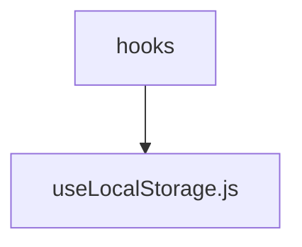

**Diagram 8: `jobs` Folder**
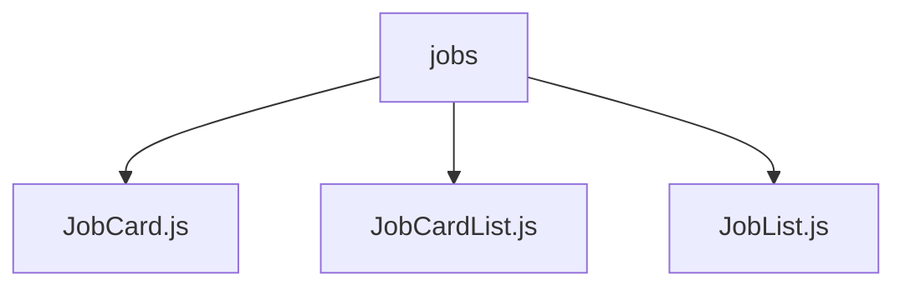

**Diagram 9: `profiles` Folder**
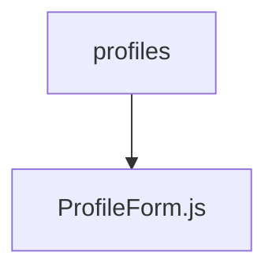

**Diagram 10: `routes-nav` Folder**
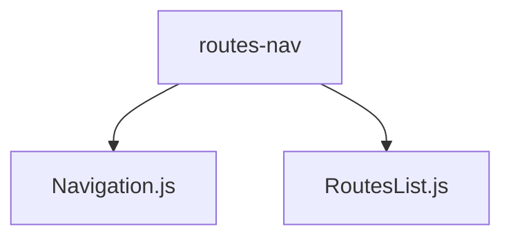
