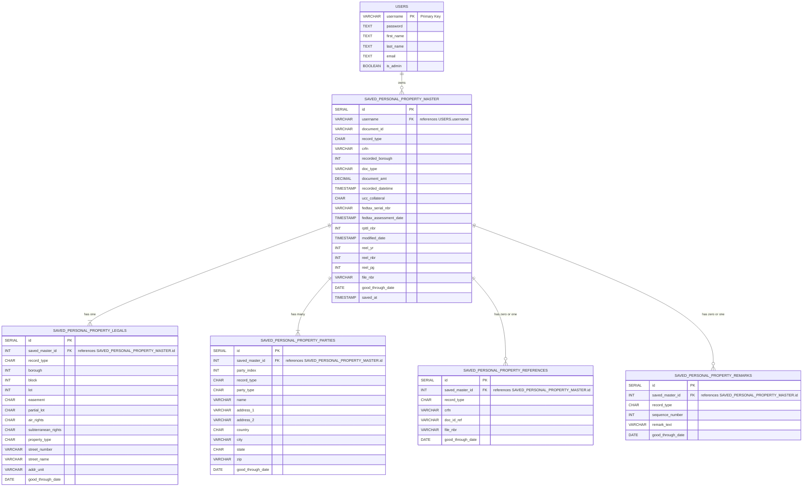

# SNCARIS (frontend)

## Table of Contents

- [SNCARIS (frontend)](#sncaris-frontend)
  - [Table of Contents](#table-of-contents)
- [CAPSTONE SUBMISSION REQUIREMENTS](#capstone-submission-requirements)
  - [The title of your site and a link to the URL where it is deployed](#the-title-of-your-site-and-a-link-to-the-url-where-it-is-deployed)
  - [Description \& Features](#description--features)
    - [Core Features](#core-features)
      - [Comprehensive Search Options](#comprehensive-search-options)
      - [User Experience Enhancements](#user-experience-enhancements)
      - ["Favorites" Functionality](#favorites-functionality)
      - [Data Integration](#data-integration)
    - [Frontend Implementation](#frontend-implementation)
  - [Where your tests are and how to run them](#where-your-tests-are-and-how-to-run-them)
    - [Test Locations](#test-locations)
    - [Running Tests](#running-tests)
    - [Test Coverage](#test-coverage)
    - [Testing Philosophy](#testing-philosophy)
    - [Test Utilities](#test-utilities)
  - [WALKTHROUGH](#walkthrough)
    - [User registers \& logs in](#user-registers--logs-in)
      - [Registration Process:](#registration-process)
      - [Login Process (for returning users):](#login-process-for-returning-users)
    - [User searches for a property's borough, block and lot using street address parameters](#user-searches-for-a-propertys-borough-block-and-lot-using-street-address-parameters)
      - [Accessing the Address Search:](#accessing-the-address-search)
      - [Entering Address Information:](#entering-address-information)
      - [Viewing Search Results:](#viewing-search-results)
      - [Result Interpretation:](#result-interpretation)
    - [Once BBL is obtained, user can view that data and click the "Search By BBL" button](#once-bbl-is-obtained-user-can-view-that-data-and-click-the-search-by-bbl-button)
      - [BBL Search Transition:](#bbl-search-transition)
      - [Parcel Search Form:](#parcel-search-form)
      - [Refining the Parcel Search:](#refining-the-parcel-search)
    - [User can search for deed information by choosing "DEEDS \& OTHER CONVEYANCES"](#user-can-search-for-deed-information-by-choosing-deeds--other-conveyances)
      - [Specifying Document Types:](#specifying-document-types)
      - [Search Processing:](#search-processing)
      - [Results Overview:](#results-overview)
    - [The user can then browse the documents by selecting the DOCUMENT ID](#the-user-can-then-browse-the-documents-by-selecting-the-document-id)
      - [Document Selection:](#document-selection)
      - [Document Interaction Options:](#document-interaction-options)
      - [Saving a Document:](#saving-a-document)
      - [Viewing Document Details:](#viewing-document-details)
      - [Exploring in ACRIS:](#exploring-in-acris)
      - [Additional Features:](#additional-features)
  - [Keep the API in there, and if you have anything to say about the API then add some notes. If you have created your own API, please document the process.](#keep-the-api-in-there-and-if-you-have-anything-to-say-about-the-api-then-add-some-notes-if-you-have-created-your-own-api-please-document-the-process)
  - [Tech Stack (frontend)](#tech-stack-frontend)
    - [Core Technologies](#core-technologies)
    - [State Management \& Data Flow](#state-management--data-flow)
    - [UI Components \& Styling](#ui-components--styling)
    - [Form Handling \& Validation](#form-handling--validation)
    - [Data Visualization \& Display](#data-visualization--display)
    - [Routing \& Navigation](#routing--navigation)
    - [Testing \& Quality Assurance](#testing--quality-assurance)
    - [Build Tools \& Development Environment](#build-tools--development-environment)
    - [Performance Optimization](#performance-optimization)
    - [Deployment \& CI/CD](#deployment--cicd)
  - [how to use this repository](#how-to-use-this-repository)
- [Overview of SNACRIS](#overview-of-snacris)
  - [Features Implemented](#features-implemented)
  - [Technology Stack](#technology-stack)
  - [DATABASE SCHEMA \& THIRD PARTY API DIAGRAMS (ACRIS)](#database-schema--third-party-api-diagrams-acris)
    - [DATABASE SCHEMA](#database-schema)
      - [Users \& Real Property](#users--real-property)
      - [Users \& Personal Property](#users--personal-property)
      - [Users \& Favorites](#users--favorites)
    - [ACRIS DATASETS (THIRD PARTY API)](#acris-datasets-third-party-api)
      - [Real Property (Overview)](#real-property-overview)
      - [Real Property - Master](#real-property---master)
      - [Real Property - Legals](#real-property---legals)
      - [Real Property - Parties](#real-property---parties)
      - [Real Property - References](#real-property---references)
      - [Real Property - Remarks](#real-property---remarks)
      - [Personal Property (Overview)](#personal-property-overview)
      - [Personal Property - Master](#personal-property---master)
      - [Personal Property - Legals](#personal-property---legals)
      - [Personal Property - Parties](#personal-property---parties)
      - [Personal Property - References](#personal-property---references)
      - [Personal Property - Remarks](#personal-property---remarks)
      - [Code Mappings - Document Control Codes](#code-mappings---document-control-codes)
      - [Code Mappings - UCC Collateral Codes](#code-mappings---ucc-collateral-codes)
      - [Code Mappings - Property Type Codes](#code-mappings---property-type-codes)
      - [Code Mappings - State (USA) Codes](#code-mappings---state-usa-codes)
      - [Code Mappings - Country Codes](#code-mappings---country-codes)

# CAPSTONE SUBMISSION REQUIREMENTS

## The title of your site and a link to the URL where it is deployed

[SNACRIS.NYC](https://snacris.nyc/)

This project is called "SNACRIS" which is derived from the acronym "ACRIS". ACRIS is New York City's "Automated City Record Indexing System". The City Record is responsible for NYC's public land records such as deeds, mortgages, etc. The [ACRIS website](https://www.nyc.gov/site/finance/property/acris.page) provides public land record data for real estate professionals and contains over 125 million rows of data. SNACRIS is my attempt to clone this website while adding modern web development best practices and quality of life improvements.

## Description & Features

SNACRIS (derived from NYC's ACRIS system) is a modern web application that provides access to New York City's public land records data. The application serves as a more user-friendly and feature-rich alternative to the official ACRIS website, with improvements in UI/UX, data management, and personalization.

### Core Features

#### Comprehensive Search Options

- **Party Name Search**: Search by individual or business names with partial matching
- **Parcel Identifier (BBL) Search**: Look up properties by Borough-Block-Lot identifiers
- **Document Type & Class Search**: Filter documents by type (deeds, mortgages, liens, etc.)
- **Document ID/CRFN Search**: Retrieve specific documents by their unique identifiers
- **Transaction Number Search**: Find related document filings
- **Legacy Search Options**: Access pre-ACRIS records via Reel & Page or UCC/Federal Lien File Number

#### User Experience Enhancements

- **Intuitive UI**: Clean, modern interface with responsive design
- **Dynamic Forms**: Context-aware inputs and dropdowns populated from code mappings
- **Search Results Management**: Sortable and filterable tables for efficient data review
- **Personalization**: User accounts with saved searches and favorites

#### "Favorites" Functionality

- Save entire documents for quick future reference
- Bookmark specific party names or contacts
- Save property identifiers (BBLs) to track specific parcels
- Personalized dropdown/autocomplete options from saved items

#### Data Integration

- Unified access to 15 different NYC property data APIs
- Seamless integration of real property and personal property records
- Code mapping tables for document types, party roles, boroughs, and more

### Frontend Implementation

The frontend is built with React and follows modern best practices:

- **Component Architecture**: Modular, reusable components organized by feature
- **Context-Based State Management**: Using React Context API for user authentication and application state
- **Custom Hooks**: Specialized hooks for common functionality (date formatting, local storage, etc.)
- **Responsive Design**: Mobile-friendly interface that works across devices
- **Comprehensive Testing**: Jest test suite with high coverage for reliability
- **Accessibility**: WCAG compliance for inclusive user experience

The application is deployed at [SNACRIS.NYC](https://snacris.nyc/) and provides an essential tool for real estate professionals, researchers, and anyone interested in NYC property records.

## Where your tests are and how to run them

SNACRIS has a comprehensive testing suite using Jest and React Testing Library to ensure code quality and reliability.

### Test Locations

Tests are co-located with their corresponding components and organized as follows:

- **Component Tests**: Each component has its own test file with the naming pattern `ComponentName.test.js` in the same directory as the component
- **API Tests**: Located in `/src/api/api.test.js`
- **Context Tests**: Auth context testing is in `/src/auth/UserContext.test.js`
- **Hooks Tests**: Custom hooks tests are in the `/src/hooks` directory with the naming pattern `hookName.test.js`
- **Utility Tests**: Helper function tests are in their respective directories

### Running Tests

To run the test suite:

```bash
# Run all tests
npm test

# Run tests with coverage report
npm test -- --coverage

# Run tests in watch mode (development)
npm test -- --watch

# Run a specific test file
npm test -- src/components/ComponentName.test.js
```

### Test Coverage

The project has a strong focus on test coverage. Current coverage reports can be viewed by:

1. Running the coverage command: `npm test -- --coverage`
2. Opening the generated report at `coverage/lcov-report/index.html` in your browser

The test suite includes:

- **Unit Tests**: Testing individual components in isolation
- **Integration Tests**: Testing component interactions
- **Form Validation Tests**: Ensuring forms properly validate user input
- **Context API Tests**: Verifying authentication and state management
- **API Mock Tests**: Testing API interactions with mocked responses

### Testing Philosophy

Tests in SNACRIS follow these principles:

- Behavior-driven tests that verify functionality from a user perspective
- Snapshot tests to prevent unintended UI changes
- Comprehensive form validation testing
- Mocked API calls to test network request handling
- Authentication flow testing

### Test Utilities

Custom test utilities are available in `/src/test-utils/test-helpers.js` to facilitate testing, including:

- Custom render functions with context providers
- Mock API response helpers
- Authentication test helpers

## WALKTHROUGH

SNACRIS provides a streamlined experience for accessing NYC property records. Here's a detailed user flow from the frontend perspective:

### User registers & logs in

#### Registration Process:

1. Navigate to the SNACRIS homepage at [https://snacris.nyc](https://snacris.nyc)
2. Click the "Register" button in the top navigation
3. Complete the registration form with:
   - Username (unique identifier)
   - Password (with confirmation)
   - First and last name
   - Email address
4. Click "Create Account"
5. The system creates your account and automatically logs you in

#### Login Process (for returning users):

1. Navigate to the SNACRIS homepage
2. Click the "Login" button
3. Enter your username and password
4. Click "Sign In"
5. The system authenticates you and redirects to your personalized dashboard

### User searches for a property's borough, block and lot using street address parameters

> **NOTE:** ACRIS DATA DOES NOT ALWAYS MATCH GOOGLE MAPS DATA SO I SUGGEST USING THE ADDRESSES BELOW UNLESS YOU WANT TO TRY USING ADDRESSES FROM GOOGLE.

#### Accessing the Address Search:

1. From the dashboard, click the "Search by Address" option in the main navigation
2. The address search form appears with fields for street number, street name, and borough

#### Entering Address Information:

1. Enter one of these verified test addresses:
   - 624 EAST 16 STREET, Brooklyn
   - 1424 Avenue J, Brooklyn
   - 19 Old Fulton St, Brooklyn
2. Select "Brooklyn" from the borough dropdown menu
3. Click the "Search" button

#### Viewing Search Results:

1. The system queries the NYC ACRIS database and returns matching properties
2. Results display in a clean table format showing:
   - Borough-Block-Lot (BBL) identifier
   - Property type
   - Street address details
   - Unit information (if applicable)
   - Air/subterranean rights indicators

#### Result Interpretation:

1. The BBL identifier is displayed prominently (e.g., Borough: 3, Block: 6718, Lot: 48)
2. Property characteristics are shown with clear labels
3. If multiple matches exist, they are listed in order of relevance

### Once BBL is obtained, user can view that data and click the "Search By BBL" button

#### BBL Search Transition:

1. From the address search results, identify the desired property's BBL
2. Click the "Search By BBL" button adjacent to the property listing
3. The system transitions to the Parcel Search page with the BBL pre-populated

#### Parcel Search Form:

1. The form displays with the Borough, Block, and Lot fields already filled
2. Additional options appear:
   - Optional Unit field for condominium searches
   - Document Class dropdown menu
   - Date Range selectors
   - Record Type filters

#### Refining the Parcel Search:

1. Leave the BBL information as is
2. Select optional filters if desired:
   - Choose a document class (e.g., "All Classes" for comprehensive results)
   - Set a date range if looking for specific time periods
3. Click "Search" to execute the parcel search

### User can search for deed information by choosing "DEEDS & OTHER CONVEYANCES"

#### Specifying Document Types:

1. In the Document Class dropdown, select "DEEDS & OTHER CONVEYANCES"
2. Notice that the Document Type dropdown updates with relevant options
3. Select "DEED" from the Document Type dropdown
4. Verify the Borough is still correct (e.g., "Brooklyn")
5. Ensure the BBL information is accurate
6. Click "Submit" to execute the search

#### Search Processing:

1. The system displays a loading indicator
2. Behind the scenes, it queries multiple ACRIS datasets:
   - Master records for deed transactions
   - Legal property descriptions
   - Party information (buyers/sellers)
   - Document references
   - Remarks and notes

#### Results Overview:

1. Search results appear as a list of document IDs with summary information:
   - Document ID (16-character identifier)
   - Document Type (DEED)
   - Recorded Date
   - Parties involved (typically Grantor/Grantee)
   - Amount (if applicable)
2. Results are sorted by recorded date (newest first)

### The user can then browse the documents by selecting the DOCUMENT ID

#### Document Selection:

1. From the search results list, click on a Document ID to view details
2. The system loads a comprehensive document view with five key sections:
   - Master Record (transaction details)
   - Parties (individuals/organizations involved)
   - Property Details (legal description)
   - References (related documents)
   - Remarks (additional notes)

#### Document Interaction Options:

Three primary action buttons appear with each document:

- **SAVE** - Saves the complete document to your personal SNACRIS account
- **DOCUMENT DETAIL** - Expands to show all available metadata and fields
- **VIEW IN ACRIS** - Opens the official NYC ACRIS website view in a new tab

#### Saving a Document:

1. Click the "SAVE" button to add the document to your collection
2. A confirmation appears: "Document successfully saved to your account"
3. The saved document is now accessible from your user dashboard under "Saved Documents"

#### Viewing Document Details:

1. Click "DOCUMENT DETAIL" to expand all sections
2. Master Record shows the transaction date, amount, type, and identifiers
3. Parties section lists all entities involved with their roles and contact information
4. Property Details shows the legal description including borough, block, lot, and unit
5. References section displays links to related documents
6. Remarks section shows any additional notes or comments

#### Exploring in ACRIS:

1. Click "VIEW IN ACRIS" to open the NYC government ACRIS page
2. Compare the SNACRIS simplified view with the original government interface
3. Use ACRIS for downloading official PDF copies of documents if needed

#### Additional Features:

- Use the breadcrumb navigation to return to search results
- Click on party names to search for other documents with the same party
- Use the "Back to Search" button to initiate a new search
- Access your saved documents anytime from the user dashboard

## Keep the API in there, and if you have anything to say about the API then add some notes. If you have created your own API, please document the process.

## Tech Stack (frontend)

The SNACRIS frontend is built with modern web technologies to provide a robust, maintainable, and user-friendly interface for accessing NYC property records:

### Core Technologies

- **React 17**: Component-based UI library for building the interactive interface
- **JavaScript/ES6+**: Modern JavaScript syntax with advanced features
- **CSS3**: Custom styling with flexbox and grid layouts
- **HTML5**: Semantic markup for accessibility and SEO

### State Management & Data Flow

- **React Context API**: For global state management (user authentication, preferences)
- **Custom Hooks**: For reusable stateful logic across components
- **Axios**: For HTTP requests to the backend API

### UI Components & Styling

- **Bootstrap 5**: For responsive grid layout and base components
- **React-Bootstrap**: React-compatible Bootstrap components
- **Font Awesome**: For iconography throughout the application
- **Custom CSS**: For application-specific styling and theming

### Form Handling & Validation

- **Formik**: For complex form state management
- **Yup**: For declarative form validation schemas
- **React-Select**: For enhanced dropdown components with search functionality
- **React-Datepicker**: For date range selection inputs

### Data Visualization & Display

- **React-Table**: For sortable, filterable data tables
- **Chart.js**: For data visualization where applicable
- **React-PDF**: For document preview capabilities

### Routing & Navigation

- **React Router 6**: For client-side routing and navigation
- **History API**: For programmatic navigation and breadcrumb functionality

### Testing & Quality Assurance

- **Jest**: JavaScript testing framework
- **React Testing Library**: For component testing
- **MSW (Mock Service Worker)**: For API mocking in tests
- **Cypress**: For end-to-end testing critical user flows

### Build Tools & Development Environment

- **Create React App**: For application scaffolding and build configuration
- **Webpack**: For module bundling (via Create React App)
- **Babel**: For JavaScript transpilation
- **ESLint**: For code quality and consistency
- **Prettier**: For code formatting

### Performance Optimization

- **React.lazy()**: For code splitting and lazy loading components
- **React.memo()**: For component memoization to prevent unnecessary re-renders
- **Debouncing**: For search input performance optimization
- **Service Workers**: For caching and offline capabilities

### Deployment & CI/CD

- **GitHub Actions**: For continuous integration and deployment
- **Netlify**: For hosting the frontend application

## how to use this repository

This repository contains the frontend code for SNACRIS. Follow these instructions to set up and run the application locally.

### Prerequisites

Before getting started, ensure you have the following installed:

- Node.js (v14.x or higher)
- npm (v6.x or higher)
- Git

### Clone the Repository

```bash
# Clone the repository
git clone https://github.com/yourusername/snacris--frontend.git

# Navigate to the project directory
cd snacris--frontend
```

### Install Dependencies

```bash
# Install all required packages
npm install
```

### Configuration

1. Create a `.env` file in the root directory with the following variables:

```
REACT_APP_BASE_URL=http://localhost:3001  # Backend API URL
REACT_APP_ENV=development
```

2. For production deployment, create a `.env.production` file:

```
REACT_APP_BASE_URL=https://api.snacris.nyc
REACT_APP_ENV=production
```

### Start Development Server

```bash
# Start the development server
npm start
```

This will run the app in development mode. Open [http://localhost:3000](http://localhost:3000) to view it in your browser. The page will reload when you make changes, and lint errors will appear in the console.

### Run Tests

```bash
# Run all tests
npm test

# Run tests with coverage
npm test -- --coverage
```

### Create Production Build

```bash
# Build the app for production
npm run build
```

This builds the app for production to the `build` folder, optimizing the build for best performance. The build is minified and the filenames include hashes.

### Deploy

After building, you can deploy the contents of the `build` folder to any static hosting service (Netlify, Vercel, AWS S3, etc.).

```bash
# Example deployment to Netlify (if Netlify CLI is installed)
netlify deploy --prod
```

### Project Structure

The frontend codebase is organized as follows:

```
src/
├── api/              # API service layer for backend communication
├── assets/           # Static assets (images, fonts, etc.)
├── auth/             # Authentication related components and context
├── common/           # Shared UI components
├── components/       # Feature-specific components
├── hooks/            # Custom React hooks
├── pages/            # Page components that correspond to routes
├── routes-nav/       # Routing configuration
├── test-utils/       # Testing utilities and helpers
├── App.js            # Main application component
└── index.js          # Application entry point
```

### Backend Communication

The frontend communicates with the SNACRIS backend API. Make sure the backend server is running and accessible at the URL specified in your `.env` file.

# Overview of SNACRIS

- Unified Data Layer
  15 APIs under the hood:

Real-Property (master, legals, parties, references, remarks)

Personal-Property (master, legals, parties, references, remarks)

Code Mappings (document classes, document types, boroughs, party types, UCC codes, etc.)

Code Mappings tables are pre-seeded from JSON key/value pairs to drive dropdowns and validate inputs when querying the Real- and Personal-Property endpoints.

- Search By Party Name
  Mirrors ACRIS’s “Name” search:

Free-form individual (Last, First, MI, Suffix) or business name entry (all-caps).

Partial match on leading substrings (e.g. “SMI” returns SMITH, SMILEY, etc.).

Date range, Party type (Grantor/Grantee, Borrower/Lender…), and Borough filters.

Dropdowns populated dynamically from Code Mappings (party roles, borough list).

- Search By Parcel Identifier (BBL)
  Borough–Block–Lot (+ unit):

Exact BBL → returns all records for that parcel.

BBL + unit → returns matching unit-level records.

Block only (lot=0000) → returns all lots in block.

Date range & Document class filters via Code Mappings.

- Search By Document Type & Class
  Document Class dropdown (e.g. Deeds, Mortgages, Liens)

Document Type dropdown, filtered by chosen class

Date range (max 30 days) and Borough qualifiers

- Search By Document ID / CRFN
  Enter either the 16-char Document ID or City Register File Number.

Returns the single cover‐page record with full metadata.

- Search By Transaction Number
  Returns all docs sharing the same Transaction Number (grouping of related filings).

- Legacy Searches
  Reel & Page (pre-ACRIS records, by Borough + Year + Reel + Page).

UCC / Federal Lien File Number (pre-2003 lien docs, by Borough + File Number).

## Features Implemented

- “Favorite” & “Save” Workflows
  After any search, users can bookmark:

Entire document (all five sub-tables)

Single Party Name or Party Contact

Parcel Identifier (BBL)

Favorites persist via user-scoped tables (saved_party_names, saved_party_contacts, saved_properties) and reload automatically as dropdown/autocomplete options.

## Technology Stack

Front End: React + TypeScript, dynamic forms & results tables

Back End: Node.js/Express + PostgreSQL, with REST endpoints for each of the 15 APIs

Data Modeling: 10 relational tables for Real & Personal Property, plus 3 “favorites” tables and Code Mappings

Authentication: JWT Authentication with per-user favorites and CRUD

SNACRIS brings ACRIS’s full power to a modern web stack, enriched with code-driven dropdowns, “save for later” workflows, and a unified developer-friendly API layer.

## DATABASE SCHEMA & THIRD PARTY API DIAGRAMS (ACRIS)

### DATABASE SCHEMA

#### Users & Real Property


#### Users & Personal Property



#### Users & Favorites


### ACRIS DATASETS (THIRD PARTY API)

#### Real Property (Overview)

NB--> Include this overview in the backend folder located here `snacris--backend/thirdPartyApi/acris/real-property/`


#### Real Property - Master


#### Real Property - Legals


#### Real Property - Parties


#### Real Property - References


#### Real Property - Remarks


#### Personal Property (Overview)

NB --> Include this overview in the backend folder located here: `snacris--backend/thirdPartyApi/acris/personal-property`


#### Personal Property - Master


#### Personal Property - Legals


#### Personal Property - Parties


#### Personal Property - References


#### Personal Property - Remarks


#### Code Mappings - Document Control Codes

NB --> Include these relational ERD diagrams in the backend folder located here: `thirdPartyApi/acris/code-maps`


#### Code Mappings - UCC Collateral Codes


#### Code Mappings - Property Type Codes


#### Code Mappings - State (USA) Codes


#### Code Mappings - Country Codes


