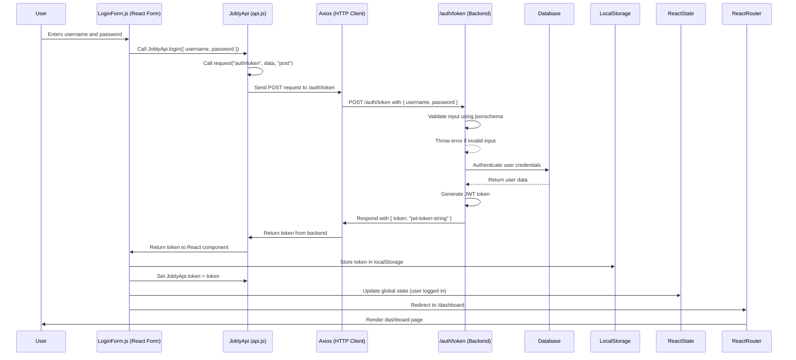

# User Login Overview
This explanation breaks down the flow of data and the sequence of operations when a registered user logs in to the website. It involves both the frontend (`api.js`) and backend (`auth.js`) code.

**Here is the overall flow:**

1. The user enters their username and password into the login form on the React frontend.
2. The frontend sends a POST request to the `/auth/token` endpoint using the `JoblyApi.login()` method.
3. The backend receives the request, validates the input, and authenticates the user.
4. If authentication is successful:
    - The backend generates a `JWT token` and sends it back to the frontend.
5. The frontend processes the response, stores the `JWT token` for future requests, and updates the application state (e.g., logged-in user).
6. The user is redirected to the dashboard or another protected page.

## Front End `api.js`

```javascript
import axios from "axios";

const BASE_URL = process.env.REACT_APP_BASE_URL || "http://localhost:3001";

/** API Class.
 *
 * Static class tying together methods used to get/send to to the API.
 * There shouldn't be any frontend-specific stuff here, and there shouldn't
 * be any API-aware stuff elsewhere in the frontend.
 *
 */

class JoblyApi {
  // the token for interactive with the API will be stored here.
  static token;

  static async request(endpoint, data = {}, method = "get") {
    console.debug("API Call:", endpoint, data, method);

    const url = `${BASE_URL}/${endpoint}`;
    const headers = { Authorization: `Bearer ${JoblyApi.token}` };
    const params = method === "get" ? data : {};

    try {
      return (await axios({ url, method, data, params, headers })).data;
    } catch (err) {
      console.error("API Error:", err.response);
      let message = err.response.data.error.message;
      throw Array.isArray(message) ? message : [message];
    }
  }

  // Individual API routes

  /** Get the current user. */

  static async getCurrentUser(username) {
    let res = await this.request(`users/${username}`);
    return res.user;
  }

  /** Get companies (filtered by name if not undefined) */

  static async getCompanies(nameLike) {
    let res = await this.request("companies", { nameLike });
    return res.companies;
  }

  /** Get details on a company by handle. */

  static async getCompany(handle) {
    let res = await this.request(`companies/${handle}`);
    return res.company;
  }

  /** Get list of jobs (filtered by title if not undefined) */

  static async getJobs(title) {
    let res = await this.request("jobs", { title });
    return res.jobs;
  }

  /** Apply to a job */

  static async applyToJob(username, id) {
    await this.request(`users/${username}/jobs/${id}`, {}, "post");
  }

  /** Get token for login from username, password. */

  static async login(data) {
    let res = await this.request(`auth/token`, data, "post");
    return res.token;
  }

  /** Signup for site. */

  static async signup(data) {
    let res = await this.request(`auth/register`, data, "post");
    return res.token;
  }

  /** Save user profile page. */

  static async saveProfile(username, data) {
    let res = await this.request(`users/${username}`, data, "patch");
    return res.user;
  }
}

export default JoblyApi;
```

## Back End `auth.js`
```javascript
"use strict";

/** Routes for authentication. */

const jsonschema = require("jsonschema");

const User = require("../models/user");
const express = require("express");
const router = new express.Router();
const { createToken } = require("../helpers/tokens");
const { ensureLoggedIn, ensureAdmin } = require("../middleware/auth");
const userAuthSchema = require("../schemas/userAuth.json");
const userRegisterSchema = require("../schemas/userRegister.json");
const { BadRequestError } = require("../expressError");

/** POST /auth/token:  { username, password } => { token }
 *
 * Returns JWT token which can be used to authenticate further requests.
 *
 * Authorization required: none
 */

router.post("/token", async function (req, res, next) {
  try {
    const validator = jsonschema.validate(req.body, userAuthSchema);
    if (!validator.valid) {
      const errs = validator.errors.map(e => e.stack);
      throw new BadRequestError(errs);
    }

    const { username, password } = req.body;
    const user = await User.authenticate(username, password);
    const token = createToken(user);
    return res.json({ token });
  } catch (err) {
    return next(err);
  }
});


/** POST /auth/register:   { user } => { token }
 *
 * user must include { username, password, firstName, lastName, email }
 *
 * Returns JWT token which can be used to authenticate further requests.
 *
 * Authorization required: none
 */

router.post("/register", async function (req, res, next) {
  try {
    const validator = jsonschema.validate(req.body, userRegisterSchema);
    if (!validator.valid) {
      const errs = validator.errors.map(e => e.stack);
      throw new BadRequestError(errs);
    }

    const newUser = await User.register({ ...req.body, isAdmin: false });
    const token = createToken(newUser);
    return res.status(201).json({ token });
  } catch (err) {
    return next(err);
  }
});

/** POST /auth/register-admin:   { user } => { token }
 *
 * user must include { username, password, firstName, lastName, email }
 *
 * Returns JWT token which can be used to authenticate further requests.
 *
 * Authorization required: login and admin
 */

router.post("/register-admin", ensureLoggedIn, ensureAdmin, async function (req, res, next) {
  try {
    const validator = jsonschema.validate(req.body, userRegisterSchema);
    if (!validator.valid) {
      const errs = validator.errors.map(e => e.stack);
      throw new BadRequestError(errs);
    }

    const newUser = await User.register({ ...req.body, isAdmin: true });
    const token = createToken(newUser);
    return res.status(201).json({ token });
  } catch (err) {
    return next(err);
  }
});


/** POST /auth/register-first-admin:   { user } => { token }
 *
 * user must include { username, password, firstName, lastName, email }
 *
 * Returns JWT token which can be used to authenticate further requests.
 *
 * Authorization required: none
 * 
 * This route is for creating the first admin user and should be removed or disabled after initial setup.
 */

router.post("/register-first-admin", async function (req, res, next) {
  try {
    const validator = jsonschema.validate(req.body, userRegisterSchema);
    if (!validator.valid) {
      const errs = validator.errors.map(e => e.stack);
      throw new BadRequestError(errs);
    }

    const newUser = await User.register({ ...req.body, isAdmin: true });
    const token = createToken(newUser);
    return res.status(201).json({ token });
  } catch (err) {
    return next(err);
  }
});

module.exports = router;
```

## Step-by-Step Sequence of User Login

### Step 1: User Fills Out Login Form (Frontend)
1. The user enters their `username` and `password` into a form in a React component (e.g., `LoginForm.js`).

2. On form submission, the React component calls the `JoblyApi.login()` method and passes the credentials:
```javascript
await JoblyApi.login({ username, password });
```

### Step 2: `JoblyApi.login()` Calls the `request` Method

1. The `login` method in `JoblyApi` is executed:
```javascript
static async login(data) {
  let res = await this.request(`auth/token`, data, "post");
  return res.token;
}
```
- Endpoint: `auth/token`
- Data: `{ username, password }`
- HTTP Method: `POST`

2. The `request` method constructs the API request:
```javascript
static async request(endpoint, data = {}, method = "get") {
  const url = `${BASE_URL}/${endpoint}`;
  const headers = { Authorization: `Bearer ${JoblyApi.token}` }; // No token needed for login
  const params = method === "get" ? data : {};

  return (await axios({ url, method, data, params, headers })).data;
}
```
- Constructs the URL: `http://localhost:3001/auth/token`.
- Sends a `POST` request with the user's credentials.

3. `axios` handles the HTTP request and sends it to the backend.

### Step 3: Backend Receives the Request (`POST /auth/token`)
The backend's `auth.js` file handles the `/auth/token` route:
```javascript
router.post("/token", async function (req, res, next) {
  try {
    const validator = jsonschema.validate(req.body, userAuthSchema);
    if (!validator.valid) {
      const errs = validator.errors.map(e => e.stack);
      throw new BadRequestError(errs);
    }

    const { username, password } = req.body;
    const user = await User.authenticate(username, password);
    const token = createToken(user);
    return res.json({ token });
  } catch (err) {
    return next(err);
  }
});
```

1. Validation:

- The input (`username` and `password`) is validated against `userAuthSchema` using `jsonschema`.

2. Authentication:

If the input is valid, it calls:
```javascript
const user = await User.authenticate(username, password);
```

- The `User.authenticate()` function checks the database for the user and validates the password.
- If authentication fails, an error is thrown.

3. Generate JWT Token:
If authentication succeeds, a JWT token is generated:
```javascript
const token = createToken(user);
```
- `createToken` creates a signed JWT containing the user's information (e.g., `username`, `isAdmin`).

4. Send Response:
The server responds with:
```javascript
{ "token": "jwt-token-string" }
```

### Step 4: JoblyApi.login() Processes the Response

1. The response from the backend is received in the `request` method:
```javascript
return (await axios({ url, method, data, params, headers })).data;
```

2. The `login` method extracts the `token`:
```javascript
let res = await this.request(`auth/token`, data, "post");
return res.token;
```

3. The token is returned to the React component.

### Step 5: React Component Stores the Token

1. The React component receives the JWT token and:
- Stores it in `localStorage` for persistence:
```javascript
localStorage.setItem("token", token);
```
- Sets the token in JoblyApi for future API requests:
```javascript
JoblyApi.token = token;
```

2. Updates the global state (e.g., using `React Context` or state management libraries like Redux) to indicate the user is logged in.

### Step 6: Redirect the User
After storing the token and updating the app state, the React component redirects the user to a protected page, such as the dashboard:
```javascript
history.push("/dashboard");
```

## Summary of Flow
1. Frontend:
- User submits login form → `JoblyApi.login()` is called.
2. Frontend API Call:
- `JoblyApi.login()` uses `axios` to send a `POST` request to `/auth/token`.
3. Backend:
- Validates the input, authenticates the user, generates a JWT token, and responds with `{ token: "jwt-token-string" }`.
4. Frontend Response:
- Receives the token.
- Stores the token in `localStorage` and sets it in `JoblyApi.token`.
- Updates the state to mark the user as logged in.
5. Redirect:
The user is redirected to the dashboard.

## Sequence Diagram of User Login



### Diagram Explanation 
1. Participants:

- `User`: The person interacting with the application.
- `ReactForm`: The login form component that triggers the login process.
- `JoblyAPI`: The API class responsible for sending the HTTP request.
- `Axios`: The HTTP client that sends the request to the backend.
- `Backend`: The /auth/token route that processes the login.
- `DB`: The database where user credentials are stored.

2. Flow:

- The `user` enters credentials in the login form.
- The React form calls `JoblyApi.login()` which internally calls `request()`.
- `Axios` sends a `POST` request to the backend at `/auth/token`.
- The `backend` validates the input and authenticates the user.
- If successful, the `backend` generates a JWT token and sends it back to the frontend.
- The `React component` stores the token, sets it for future requests, and updates the app state.
- Finally, the user is redirected to the dashboard using `React Router`.

3. Visual Key Points:

- The diagram clearly separates frontend and backend operations.
- It shows how the token is generated, returned, and stored.
- Highlights key interactions between components and external libraries (e.g., Axios and the backend).
