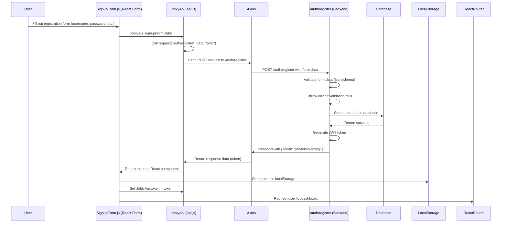

# User Registeration Overview

In order to explain the flow of data, the order of operations, and the sequence of function executions when a user registers for the first time, we need to analyze both the front-end code (`api.js`) and the back-end code (`auth.js`).  For context I have place both files below followed by an explanation.

## Front End `api.js`

```javascript
import axios from "axios";

const BASE_URL = process.env.REACT_APP_BASE_URL || "http://localhost:3001";

/** API Class.
 *
 * Static class tying together methods used to get/send to to the API.
 * There shouldn't be any frontend-specific stuff here, and there shouldn't
 * be any API-aware stuff elsewhere in the frontend.
 *
 */

class JoblyApi {
  // the token for interactive with the API will be stored here.
  static token;

  static async request(endpoint, data = {}, method = "get") {
    console.debug("API Call:", endpoint, data, method);

    const url = `${BASE_URL}/${endpoint}`;
    const headers = { Authorization: `Bearer ${JoblyApi.token}` };
    const params = method === "get" ? data : {};

    try {
      return (await axios({ url, method, data, params, headers })).data;
    } catch (err) {
      console.error("API Error:", err.response);
      let message = err.response.data.error.message;
      throw Array.isArray(message) ? message : [message];
    }
  }

  // Individual API routes

  /** Get the current user. */

  static async getCurrentUser(username) {
    let res = await this.request(`users/${username}`);
    return res.user;
  }

  /** Get companies (filtered by name if not undefined) */

  static async getCompanies(nameLike) {
    let res = await this.request("companies", { nameLike });
    return res.companies;
  }

  /** Get details on a company by handle. */

  static async getCompany(handle) {
    let res = await this.request(`companies/${handle}`);
    return res.company;
  }

  /** Get list of jobs (filtered by title if not undefined) */

  static async getJobs(title) {
    let res = await this.request("jobs", { title });
    return res.jobs;
  }

  /** Apply to a job */

  static async applyToJob(username, id) {
    await this.request(`users/${username}/jobs/${id}`, {}, "post");
  }

  /** Get token for login from username, password. */

  static async login(data) {
    let res = await this.request(`auth/token`, data, "post");
    return res.token;
  }

  /** Signup for site. */

  static async signup(data) {
    let res = await this.request(`auth/register`, data, "post");
    return res.token;
  }

  /** Save user profile page. */

  static async saveProfile(username, data) {
    let res = await this.request(`users/${username}`, data, "patch");
    return res.user;
  }
}

export default JoblyApi;
```

## Back End `auth.js`
```javascript
"use strict";

/** Routes for authentication. */

const jsonschema = require("jsonschema");

const User = require("../models/user");
const express = require("express");
const router = new express.Router();
const { createToken } = require("../helpers/tokens");
const { ensureLoggedIn, ensureAdmin } = require("../middleware/auth");
const userAuthSchema = require("../schemas/userAuth.json");
const userRegisterSchema = require("../schemas/userRegister.json");
const { BadRequestError } = require("../expressError");

/** POST /auth/token:  { username, password } => { token }
 *
 * Returns JWT token which can be used to authenticate further requests.
 *
 * Authorization required: none
 */

router.post("/token", async function (req, res, next) {
  try {
    const validator = jsonschema.validate(req.body, userAuthSchema);
    if (!validator.valid) {
      const errs = validator.errors.map(e => e.stack);
      throw new BadRequestError(errs);
    }

    const { username, password } = req.body;
    const user = await User.authenticate(username, password);
    const token = createToken(user);
    return res.json({ token });
  } catch (err) {
    return next(err);
  }
});


/** POST /auth/register:   { user } => { token }
 *
 * user must include { username, password, firstName, lastName, email }
 *
 * Returns JWT token which can be used to authenticate further requests.
 *
 * Authorization required: none
 */

router.post("/register", async function (req, res, next) {
  try {
    const validator = jsonschema.validate(req.body, userRegisterSchema);
    if (!validator.valid) {
      const errs = validator.errors.map(e => e.stack);
      throw new BadRequestError(errs);
    }

    const newUser = await User.register({ ...req.body, isAdmin: false });
    const token = createToken(newUser);
    return res.status(201).json({ token });
  } catch (err) {
    return next(err);
  }
});

/** POST /auth/register-admin:   { user } => { token }
 *
 * user must include { username, password, firstName, lastName, email }
 *
 * Returns JWT token which can be used to authenticate further requests.
 *
 * Authorization required: login and admin
 */

router.post("/register-admin", ensureLoggedIn, ensureAdmin, async function (req, res, next) {
  try {
    const validator = jsonschema.validate(req.body, userRegisterSchema);
    if (!validator.valid) {
      const errs = validator.errors.map(e => e.stack);
      throw new BadRequestError(errs);
    }

    const newUser = await User.register({ ...req.body, isAdmin: true });
    const token = createToken(newUser);
    return res.status(201).json({ token });
  } catch (err) {
    return next(err);
  }
});


/** POST /auth/register-first-admin:   { user } => { token }
 *
 * user must include { username, password, firstName, lastName, email }
 *
 * Returns JWT token which can be used to authenticate further requests.
 *
 * Authorization required: none
 * 
 * This route is for creating the first admin user and should be removed or disabled after initial setup.
 */

router.post("/register-first-admin", async function (req, res, next) {
  try {
    const validator = jsonschema.validate(req.body, userRegisterSchema);
    if (!validator.valid) {
      const errs = validator.errors.map(e => e.stack);
      throw new BadRequestError(errs);
    }

    const newUser = await User.register({ ...req.body, isAdmin: true });
    const token = createToken(newUser);
    return res.status(201).json({ token });
  } catch (err) {
    return next(err);
  }
});

module.exports = router;
```

## Flow of Data for User Registeration 
Here is a step-by-step breakdown of the process:

### Step 1: User Fills Out a Registeration Form
In the React front end, the user interacts with a registration form (e.g., `SignupForm.js`).  This form collects data like:
- `username`
- `password`
- `firstName`
- `lastName`
- `email`

### Step 2: React Component Calls the `signup` Method in `JoblyApi` (located in `api.js`)
```javascript
await JoblyApi.signup(formData);
```
**What Happens in `api.js`:**
- The `signup` method is executed:
```javascript
static async signup(data) {
  let res = await this.request(`auth/register`, data, "post");
  return res.token;
}
```
- Parameters:
    - `data` contains the form data (e.g., `{ username, password, firstName, lastName, email }`).
- Key Call:
    - `this.request("auth/register", data, "post")` sends a `POST` request to the backend's `/auth/register` endpoint.

### Step 3: The `request` Method Sends the API Call
The `request` method constructs the HTTP request:
```javascript
static async request(endpoint, data = {}, method = "get") {
  const url = `${BASE_URL}/${endpoint}`;
  const headers = { Authorization: `Bearer ${JoblyApi.token}` };
  const params = method === "get" ? data : {};

  return (await axios({ url, method, data, params, headers })).data;
}
```

1. URL: Combines `BASE_URL` and `endpoint`:

- `http://localhost:3001/auth/register`

2. Method: `POST`

3. Data: User registration form data is sent as the `data` payload.

4. Headers: No JWT token is needed here because this is a public route.

5. Execution:

- The `axios` library makes the request to the server.

### Step 4: The Backend Processes the `/auth/register` Request
The backend's `auth.js` processes the incoming request at the `/auth/register` route:
```javascript
router.post("/register", async function (req, res, next) {
  try {
    const validator = jsonschema.validate(req.body, userRegisterSchema);
    if (!validator.valid) {
      const errs = validator.errors.map(e => e.stack);
      throw new BadRequestError(errs);
    }

    const newUser = await User.register({ ...req.body, isAdmin: false });
    const token = createToken(newUser);
    return res.status(201).json({ token });
  } catch (err) {
    return next(err);
  }
});
```

**What Happens on the Backend:**

1. Validation:

- The `req.body` (form data) is validated against `userRegisterSchema` to ensure the data is complete and formatted correctly.
- If validation fails, an error is thrown.

2. Register User:

- The backend calls:
```javascript
const newUser = await User.register({ ...req.body, isAdmin: false });
```

- This function creates a new user in the database with the provided information.

3. Generate JWT Token:
- A JWT token is created for the new user:
```javascript
const token = createToken(newUser);
```
- The `createToken` function generates a signed JWT containing the user's details.

4. Send Response:
- The server responds with the token:
```json
{ "token": "jwt-token-string" }
```

### Step 5: Backend Response is Processed in `JoblyApi`

The backend's response (a JWT token) is received by the `request` method:

- The response data is returned to the `signup` method:
```javascript
let res = await this.request(`auth/register`, data, "post");
return res.token;
```
- `signup` then returns the token to the React component.

### Step 6: React Stores the Token
In the React component:

1. The token is received from the `signup` method.

2. The token is typically stored for future authenticated requests:

- In `localStorage`
```javascript
localStorage.setItem("token", token);
```
- Or in a global state using `React Context` or another state management library.

3. Set Authorization:
- The token is also set in the JoblyApi class for future API calls:
```javascript
JoblyApi.token = token;
```

### Step 7: User is Redirected
After successfully registering and logging in:

1. The React component redirects the user to another page (e.g., the homepage or user dashboard).
- Using React Router:
```javascript
history.push("/dashboard");
```

## Summary of the Sequence

1. Front End:

- User submits the registration form.
- `JoblyApi.signup(formData)` is called.
- `this.request("auth/register", data, "post")` sends a request to the server.

2. Backend:

- Validates the form data (`jsonschema`).
- Creates a new user in the database (`User.register`).
- Generates a JWT token (`createToken`).
- Sends the token in the response.

3. Front End:
- Receives the JWT token.
- Stores it in `localStorage` and sets it in `JoblyApi.token`.
- Redirects the user to the appropriate page.

## Sequence Diagram



### How the Diagram Works

1. **Participants**:

- `User`: Represents the user filling out the form.
- `ReactForm`: Represents the React component handling the form submission.
- `JoblyAPI`: Represents the JoblyApi class in api.js.
- `Axios`: Represents the axios library sending HTTP requests.
- `Backend`: Represents the /auth/register route and the backend logic.
- `DB`: Represents the database where user data is stored.

2. **Flow**:

- The user fills out the registration form.
- The `signup` method in `JoblyApi` sends a `POST` request to the `/auth/register` endpoint.
- The backend validates the data, creates the user, generates a JWT token, and sends it back.
- The front end processes the response, stores the token in `localStorage`, updates the API class for future authenticated requests, and redirects the user to the dashboard.